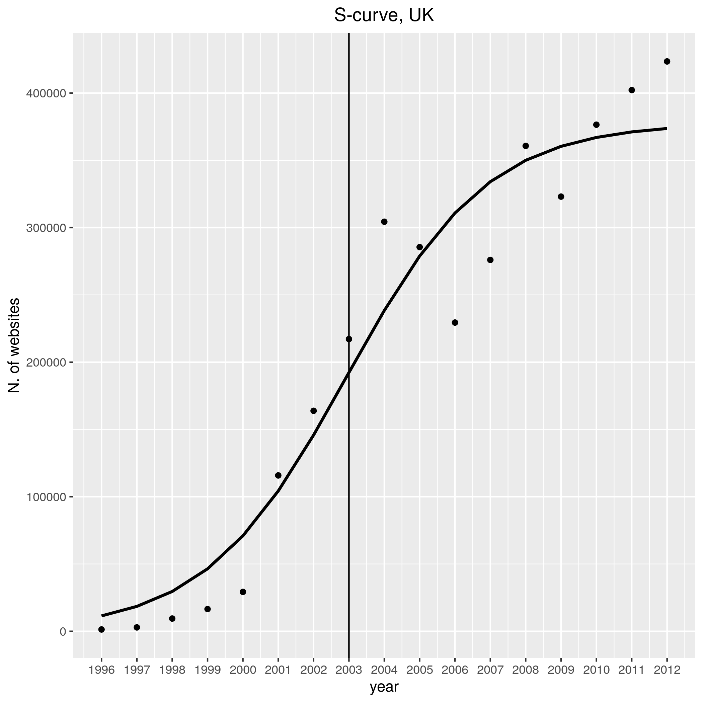

---
authors:
- admin
categories:
- Blog
date: "2022-06-06T00:00:00Z"
draft: false
featured: false
#header:
#  image: "headers/getting-started.png"
#  caption: "Image credit: [**Academic**](https://github.com/gcushen/hugo-academic/)"
#  preview_only: false
image:
  caption: ""
  focal_point: ""
  placement: 2
  preview_only: true
#lastmod: "2020-04-24T00:00:00Z"
projects: []
subtitle: 'My presentation for the Global Conference on Economic Geography'
summary: My presentation for the Global Conference on Economic Geography
tags:
- Academic
title: 'Digital economy in the UK: an evolutionary story'
---

See here the [slides](./web_diffusion.html) for my [Global Conference on Economic Geography](http://www.gceg.org/) presentation.
