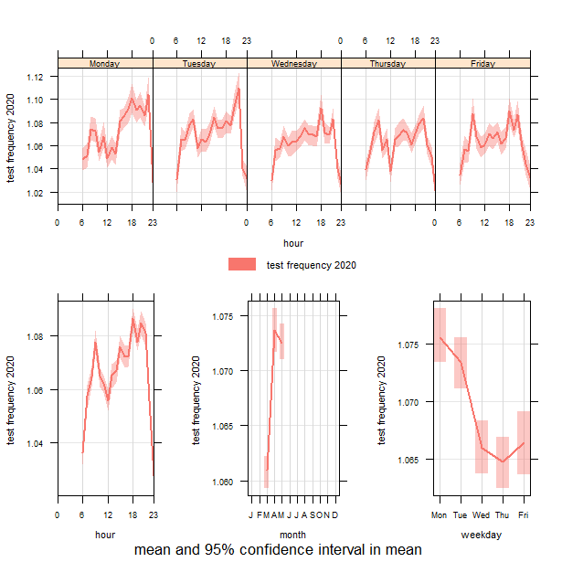

---
authors:
- admin
categories:
- Blog
date: "2021-06-13T00:00:00Z"
draft: false
featured: false
#header:
#  image: "headers/getting-started.png"
#  caption: "Image credit: [**Academic**](https://github.com/gcushen/hugo-academic/)"
#  preview_only: false
image:
  caption: ""
  focal_point: ""
  placement: 2
  preview_only: true
#lastmod: "2020-04-24T00:00:00Z"
projects: []
subtitle: 'My Regions in Recovery 2021 presentation'
summary: Working from home and digital divides; resilience during the pandemic
tags:
- Academic
title: 'Working from home and digital divides: resilience during the pandemic'
---

See here the [slides](./RinR2021.html) for my [Regions in Recovery 2021](https://www.ncl.ac.uk/digitalinstitute/events/data-nucore/) presentation.
It is based on the paper with [Hannah Budnitzh](https://www.tsu.ox.ac.uk/people/hbudnitz.html), which it will appear soon in the [Annals of the AAG](https://www.tandfonline.com/doi/full/10.1080/24694452.2021.1939647).

This paper offers a new perspective on telecommuting from the viewpoint of the complex web of digital divides. Using the UK as a case study, this paper studies how the quality and reliability of internet services, as reflected in *experienced* internet upload speeds during the spring 2020 lockdown, may reinforce or redress the spatial and social dimensions of digital divisions. Fast, reliable internet connections are necessary for the population to be able to work from home. Although not every place hosts individuals in occupations which allow for telecommuting nor with the necessary skills to effectively use the internet to telecommute, good internet connectivity is also essential to local economic resilience in a period like the current pandemic. Employing data on individual broadband speed tests and state-of-the-art time-series clustering methods, we create clusters of UK local authorities with similar temporal signatures of experienced upload speeds. We then associate these clusters of local authorities with their socioeconomic and geographic characteristics to explore how they overlap with or diverge from the existing economic and digital geography of the UK. Our analysis enables us to better understand how the spatial and social distribution of both occupations and online accessibility intersect to enable or hinder the practice of telecommuting at a time of extreme demand.

This presentation is part of the special session we organised on [Digital Tools for Recovery and the Resilience of Cities and Regions during and After a Crisis](https://events.rdmobile.com/Sessions/Details/1135845)
