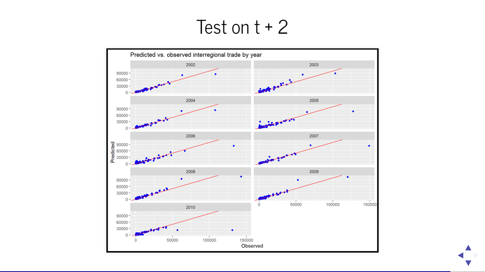

---
authors:
- admin
categories:
- Blog
date: "2021-03-02T00:00:00Z"
draft: false
featured: false
#header:
#  image: "headers/getting-started.png"
#  caption: "Image credit: [**Academic**](https://github.com/gcushen/hugo-academic/)"
#  preview_only: false
image:
  caption: ""
  focal_point: ""
  placement: 2
  preview_only: true
#lastmod: "2020-04-24T00:00:00Z"
projects: []
subtitle: 'My SAD 2021 talk'
summary: Using the web to predict regional trade flows
tags:
- Academic
title: 'Using the web to predict regional trade flows'
---

See here my [slides](./SAD2021.html) and the [talk](https://www.youtube.com/watch?v=ZT98X7XcJKM) for the [SAD seminar series](https://www.ncl.ac.uk/digitalinstitute/events/data-nucore/). It is based on our work with [Andre Carrascal Incera](https://sites.google.com/view/andrecarrascalincera/home) and [George Willis](https://twitter.com/georgewgeog) on 'Using the web to predict regional trade flows'.

We model and predict interregional trade flows for the UK using the digital traces that interregional trade leaves behind.
We scrape open web data containing hyperlinks between commercial websites and apply ML techniques for out-of-sample predictions.
Our main hypothesis is that such hyperlinks reflect business and trade relations.
