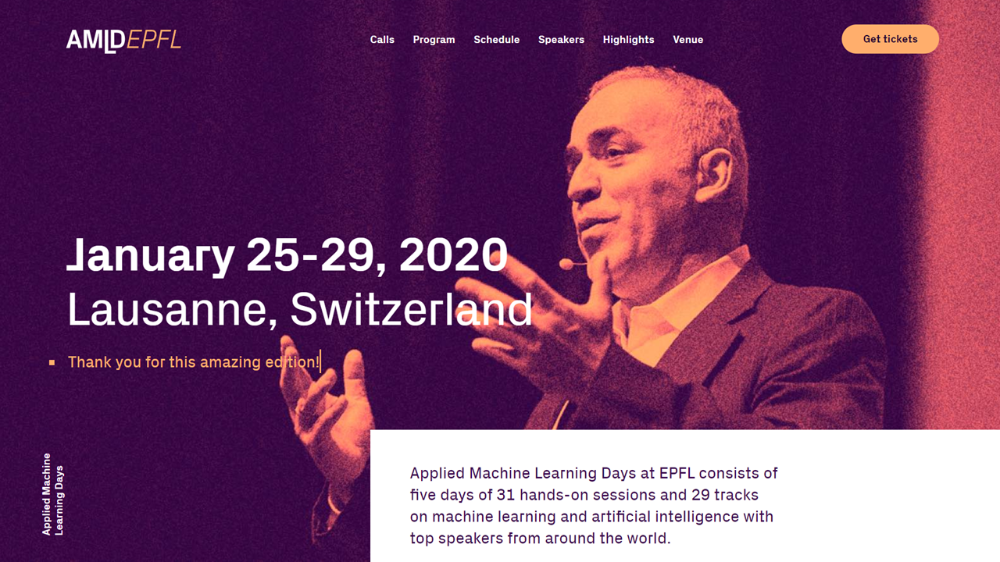

---
authors:
- admin
categories:
- Blog
date: "2020-01-25T00:00:00Z"
draft: false
featured: false
#header:
#  image: "headers/getting-started.png"
#  caption: "Image credit: [**Academic**](https://github.com/gcushen/hugo-academic/)"
#  preview_only: false
image:
  caption: ""
  focal_point: ""
  placement: 2
  preview_only: true
#lastmod: "2020-04-24T00:00:00Z"
projects: []
subtitle: 'My talk in AMLD'
summary: My talk in AMLD.
tags:
- Academic
title: 'Applied Machine Learning Days, Lausanne 2020'
---

My talk on the paper we are working with on together with Christoph Stich and [Max Nathan](http://www.maxnathan.com) on *Modelling clusters from ground up: a web data approach* during the [AI & Cities](https://appliedmldays.org/tracks/ai-cities) track of the [AMLD at EPFL](https://appliedmldays.org/).
The YouTube video is available [here](https://www.youtube.com/watch?v=d4O1W5Aho7Q).
