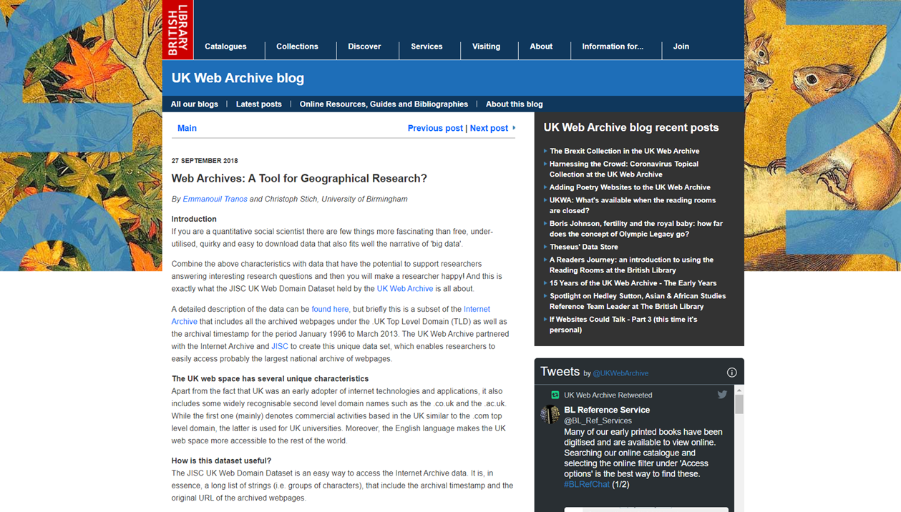

---
authors:
- admin
categories:
- Blog
date: "2018-09-24T00:00:00Z"
draft: false
featured: false
#header:
#  image: "headers/getting-started.png"
#  caption: "Image credit: [**Academic**](https://github.com/gcushen/hugo-academic/)"
#  preview_only: false
image:
  caption: ""
  focal_point: ""
  placement: 2
  preview_only: true
#lastmod: "2020-04-24T00:00:00Z"
projects: []
subtitle: 'A blogpost for the [UK Web Archive](https://blogs.bl.uk/webarchive/2018/09/web-archives-a-tool-for-geographical-research.html)'
summary: A blogpost for the [UK Web Archive](https://blogs.bl.uk/webarchive/2018/09/web-archives-a-tool-for-geographical-research.html).
tags:
- Academic
title: 'Web Archives: A Tool for Geographical Research?'
---

A blogpost for the [UK Web Archive](https://blogs.bl.uk/webarchive/) together with Christoph Stich is available [here](https://blogs.bl.uk/webarchive/2018/09/web-archives-a-tool-for-geographical-research.html).
This is an early summary of our research based on the [JISC UK Web Domain Dataset](http://data.webarchive.org.uk/opendata/ukwa.ds.2/).
