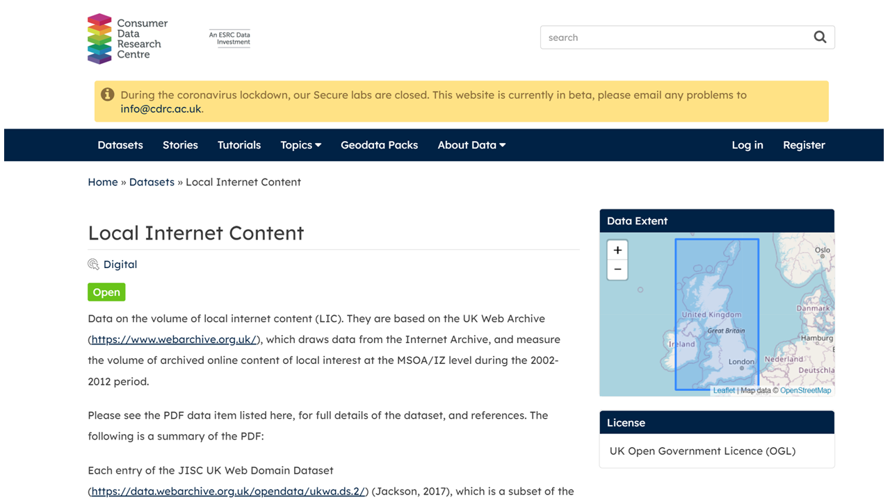

---
authors:
- admin
categories:
- Blog
date: "2019-09-24T00:00:00Z"
draft: false
featured: false
#header:
#  image: "headers/getting-started.png"
#  caption: "Image credit: [**Academic**](https://github.com/gcushen/hugo-academic/)"
#  preview_only: false
image:
  caption: ""
  focal_point: ""
  placement: 2
  preview_only: true
#lastmod: "2020-04-24T00:00:00Z"
projects: []
subtitle: 'Measuring the volume of online content of local interest'
#summary: "Knowledge spillovers, cities and social network sites".
tags:
- Academic
- Data
- Code
title: 'Local Internet Content'
---

[CDRC](https://data.cdrc.ac.uk/dataset/local-internet-content) hosts the **data** and the **code** we developed to measure the volume of Local Internet Content in the UK during 2001-2012 using the [JISC UK Web Domain Dataset](https://data.webarchive.org.uk/opendata/ukwa.ds.2/).
The above accompany our paper in *CEUS*:

Tranos, E., and C. Stich. 2020. Individual internet usage and the availability of online content of local interest: A multilevel approach. *Computers, Environment and Urban Systems* 79:101371. [https://doi.org/10.1016/j.compenvurbsys.2019.101371](https://doi.org/10.1016/j.compenvurbsys.2019.101371).

Our research was funded by a [CDRC Innovation Fund](https://www.cdrc.ac.uk/cdrc-launches-esrc-innovation-fund/).
